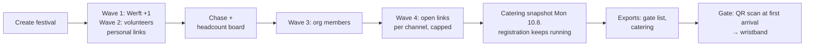

# 019 — Festival Sidetrack (Multiday Festival, 14.–16.08.2026)

**Status:** spec, pre-implementation (reworked 18.7.; Kontingente, HMAC tickets, slots + wristband model 19.7.; translated & cleaned 19.7.; organiser rounds Ä14–Ä18 19.7.; implemented & deployed 19.7.)
**Author:** Arne (discovery), Claude (write-up, 4-lens review rework)
**Date:** 2026-07-18, updated 2026-07-19

> German terms kept on purpose: **Kontingent** (an invite batch — the UI word), **Zeitfenster** (time slot), **Bändchen** (festival wristband), and all guest-facing email/UI copy. Change markers **Ä1–Ä18** (Ä = Änderung) track every decision that deviates from the original discovery.

## Context

Funke today manages single-date events (one `start_at`, capacity ≤ 500, one shared registration link, lottery/waitlist). The org is planning a 3-day festival — the **„Betriebsfeier Julius Grube Schiffswerft"** (Fri 14.8. – Sun 16.8.2026, planning target: never more than ~1000 people on site at the same time) — on short notice. Attendance is invitation-tiered: shipyard staff (Werft, each +1), ~70–80 volunteers (with plus-ones), org members (mobile machenschaften / Schaluppe), then an opened guest list. Links must not spread uncontrolled through Telegram groups. The festival is added as a self-contained subsection (like the Schaluppe subdomain, specs 010–014) — no fork, no changes to regular event behavior. **Buildup/teardown (from Wed 12.8. / Mon 17.8.) is planned and tracked separately outside this tool** — the tool covers only the festival days Fri–Sun (Ä11).

**Every decision in this spec is judged against three hard requirements:**

1. **Headcount** — know how many people are on site, per time slot. Planning target: never more than ~1000 at once — monitored via the board, deliberately NOT enforced by the tool (organiser decision 19.7.: no checkout tracking).
2. **Who comes when** — per-person presence, visible and exportable.
3. **Controlled registration** — invitation waves, personalised links, caps, chase list.

Anything that doesn't serve these three goals is cut or deferred (see marked changes Ä1–Ä18).

## How the flow works



### (a) Organizer flow

1. **Create the festival** (FestivalPage): name „Betriebsfeier Julius Grube Schiffswerft"; period Fri 14.–Sun 16.8. with self-defined **time slots** — default config per organiser decision: simple multiple choice **„Freitag" / „Samstag" / „Sonntag"** (finer windows like „Sa Abend" remain possible as pure config, Ä12); overall cap 1000 + optional per-slot caps (soft); **registration deadline = end of the festival, Sun 16.8. 23:59** — registration runs until and during the festival (Ä14); contact address for questions; **Mitmach-Hinweis** text incl. shift-plan link (Ä16, see guest flow). (Buildup/teardown run outside the tool, Ä11.)
2. **Wave 1 — shipyard staff** (InvitesPage): Kontingent „Welle 1 – Werft": one personal link per person with `tier=werft`, `max_group_size=2` (+1).
3. **Wave 2 — volunteers**: create Kontingent „Welle 2 – Helfer:innen": paste a name list (`Name` / `Name <email>` per line) → one personal link per line, with `tier=volunteer` and a plus-one allowance per person. Copy links row by row (Telegram DM) or send the email directly.
4. **Chase** via the status list: chips *offen / verschickt / angemeldet / abgelaufen*, multi-use links show `2/5 angemeldet`. Summary per Kontingent: already registered + "maximum still to expect" (open seats = Σ `max_uses × max_group_size`) against the cap.
5. **Wave 3 — org members**, then **Wave 4 — guest list**: either channel Kontingente (one shared link with `max_uses=N` per channel/community — you see which channel fills) or delegation Kontingente ("X gets 10 guest-list seats", see the Kontingent table below) — each only when the board shows the numbers allow it.
6. **Plan** with the headcount board (HeadcountPage): slot×tier matrix, accommodation totals per night slot (tent / camper / needs a spot), overbooked markers.
7. **Exports** (CSV): gate list (one row per person, alphabetical, with a tick-off column) + catering (headcounts per slot).
8. **Set up the gate**: gate link to the gate crew (via Telegram — the link is the login), print the gate list, **lay out the festival wristbands**. **No walk-ins**: no admission without a prior registration.

### (b) Guest flow

1. **Receive a personal link** (Telegram or email) → the landing page explains the festival, the dates, and the deadline.
2. **Register**: **full clear name (Vor- und Nachname required, Ä16 — also for every companion)**, email, companions (up to the invite's allowance), **day multiple choice** (one checkbox per configured slot — default „Freitag / Samstag / Sonntag"), **overnight question, always shown (Ä15)**: „Übernachtest du auf dem Gelände?" — Nein / Zelt / Camper; **phone number required when Zelt or Camper is chosen**. **Overnight is a request, not a promise (Ä17)** — the form says so explicitly („Schlafplätze sind begrenzt — wir melden uns bei dir"); organizers approve manually, and the manage page shows „Übernachtung: angefragt" vs. „zugesagt". The page prominently shows the **Mitmach-Hinweis** (Ä16): „Das ist eine Mitmachfeier — es gibt viele Schichten zu besetzen. Wenn du eine Schicht machst, trag dich im Schichtplan ein ({SchichtplanLink}) und kontaktiere Aline — sie koordiniert das und braucht deinen Kontakt."
3. **Success screen** shows the manage link immediately („Link speichern!") + a confirmation email with all details and the manage link. The QR entry codes for the whole group live on the manage page (P3).
4. **Self-edit** any time, up to and during the festival (slots, companions, overnight/phone) — the deadline is configured as the festival's end (Ä14). **Cancelling is possible at any time.**
5. The contact person **forwards the QR cards to their companions** (hint in the email and on the manage page).
6. **Arrive** → show QR (or give your name) → receive the **festival wristband**. From then on the wristband is all you need — in and out, all days.

### (c) Gate flow (gate volunteer)

1. **Open the gate link on a phone** — the link is the login, no account needed. Works on any number of devices simultaneously.
2. **First arrival: scan the QR** → card: name, group (with check-in status of the others), planned slots (info only — **slots are never checked at the gate**, they are pure planning data), and the **overnight status, checked and visualized (Ä17)**: „Übernachtung zugesagt ✓ (Camper)" / „Übernachtung nur angefragt ⚠ — nicht zugesagt" / no overnight. Confirm (one tap, 3-second undo) → the person receives their **wristband**.
3. **Re-entry: show the wristband — no scan.** The scanner is used exactly once per person.
4. **Traffic-light policy**: 🟢 valid ticket, not yet checked in → check-in + wristband. 🟡 QR already used → no second wristband; for "lost my wristband" the shift lead decides — „Trotzdem einchecken" is logged. 🔴 invalid / cancelled / stale → name search, otherwise call the organizers.
5. **No QR?** Name search in the scanner → find the person → check in, hand out the wristband.
6. **No network?** The scanner verifies the ticket signature offline too (shows the name from the ticket) and syncs check-ins once back online. The printed gate list stays at every lane as backup (pen + tick).

### Kontingente: the two dials of every invite link

A wave consists of one or more **Kontingente** — batches of links sharing settings and a `batch_label` („Welle 2 – Helfer:innen", „Gästeliste X"). Each individual link is a mini-Kontingent with two independent dials: **`max_uses`** (how often the link can be redeemed — every redemption is its own registration with its own slot grid) and **`max_group_size`** (how many companions one registration covers — shared grid, one contact person).

| Use case | Settings |
|---|---|
| Volunteer Anna + partner | `max_uses=1, max_group_size=2` |
| Person X gets 10 guest-list seats (guests register themselves) | `max_uses=10, max_group_size=1–2`, label „Gästeliste X" |
| Person X brings 9 people as one closed group | `max_uses=1, max_group_size=10` |
| Every person of a Kontingent gets 5 seats | batch: 1 link per person, each `max_uses=5` |
| Shipyard employee with +1 | `max_uses=1, max_group_size=2`, Kontingent „Welle 1 – Werft" |
| Open channel link (wave 4) | `max_uses=100, max_group_size=3` |

**Recommendation for delegation: raise `max_uses`, not `max_group_size`.** With 10 companions in one registration, the contact person would have to know when everyone comes and where they sleep — they practically never do (garbage data for goal 2). With `max_uses=10` every person registers themselves: own grid, own email, own QR codes. If the link leaks, it's capped at 10 seats — visible in the status list.

## Decisions

| Topic | Decision | Changed? |
|---|---|---|
| Structure | One continuous festival; a registration covers the whole festival | — |
| Presence | **Time-slot grid** per registration, shared by the whole group — admin-defined slots; **default config: „Freitag / Samstag / Sonntag" multiple choice** (organiser 19.7.); finer windows stay possible as config | Ä12 |
| Buildup | ~~Extended buildup/teardown days unlocked via invites~~ → **out of the tool entirely** — buildup/teardown is planned and tracked separately | Ä11 |
| Capacity | Peak-per-slot counting; overall cap + optional per-slot caps, **soft** (warn only, never block) | Ä4, Ä8, Ä12 |
| Lottery/waitlist | **None** for the festival — valid invite → immediately placed | — |
| Overnight | Overnight question **always shown** — Nein / Zelt / Camper — but it is a **request, not a promise** (capacity limited): organizers review, coordinate by phone, and set a per-registration **`overnight_approved`** flag; the gate scan checks and visualizes the status. **Currently PAUSED behind a frontend flag (Ä18)** | Ä15, Ä17, Ä18 |
| Invites | Unified `Invite` entity: label, `batch_label` (Kontingent grouping), optional email, tier (werft/volunteer/org/open), `max_uses` (1 = personal; N = capped community/delegation link), `max_group_size` (per-invite plus-one allowance), revoke, redemption tracking. Registration ONLY via invite link | Ä3, Ä7, Ä11 |
| Distribution | Batch-create from a pasted name list; copy per row / copy all (Telegram); send email via the existing Gmail integration; status list to chase non-responders | — |
| Self-service | Attendees edit their slots via the manage page — deadline is configured as the **festival's end** (registration + edits run until and during the festival); **cancel any time** | Ä5, Ä14 |
| Emails | Invite (F1), confirmation with slots (F2), change confirmation (F3), cancel confirmation (F4) | Ä2 |
| Admin views | Headcount board (slot×tier, accommodation, overbooked markers), invite status list, registration list with slot columns, CSV exports (gate, catering) | — |
| QR check-in | One QR per person (HMAC-signed, offline-verifiable), scanned **once at first arrival** → wristband; re-entry via wristband without scan; check-in log = arrival log; slots are never checked at the gate | Ä2, Ä6, Ä9, Ä10, Ä13 |
| Isolation | Festival is its own admin section; festival events hidden from the regular events UI; existing files get only additive optional fields + guards | — |
| Roles | ~~New FESTIVAL admin role~~ → organizers get regular ADMIN accounts for now | Ä1 |

### Changed decisions (Ä1–Ä18) — each individually vetoable

| # | Old | New | Why |
|---|---|---|---|
| Ä1 | New FESTIVAL admin role (festival-only view) | **Cut from the critical path** — the 2–3 festival organizers get regular ADMIN accounts; the role ships after the festival if the trust boundary matters | Real guard/nav/provisioning scope under a 4-week deadline; serves none of the 3 hard goals |
| Ä2 | QR PNGs attached to the confirmation email (server-side `segno`) | **De-scope valve taken now**: the manage page renders QRs client-side (`qrcode` npm), emails link there | The spec's own fallback; removes the server QR pipeline from the critical path |
| Ä3 | Invite rotate endpoint | **Dropped** — revoke + create-a-new-one is the same workflow | Less build/test surface; "rotate" is destructive and confusing for non-technical organizers |
| Ä4 | „Tag sehr voll" soft warnings on the public form | **P2-if-time**, threshold ≥ 90 % of the slot cap, with reassuring copy („…du kannst dich trotzdem anmelden") | Capacity steering happens on the headcount board; deterring copy risks corrupting goal 2 (people stop declaring slots honestly) |
| Ä5 | (missing) | **CANCELLED path added**: self-service cancel on the manage page (also after the deadline), admin cancel anytime; cancelled registrations excluded from headcount/exports/gate list; releases the invite `use_count` | Without cancel, headcount/catering numbers are wrong → violates hard goal 1 |
| Ä6 | Two-step lookup-then-scan at the gate | **One-tap scan** (auto-commit + visible undo) + name-search fallback + logged override | Doubles lane throughput at the Friday-evening peak; the negative-outcome policy was undefined |
| Ä7 | `sent_at` only stamped by the send-email action | **Copying a link row also stamps `sent_at`** (primary channel is Telegram) | Otherwise the chase list (hard goal 3) shows everything as „offen" forever |
| Ä8 | capacity `le=500` → `le=2000` for ALL events | **Validator: `le=500` stays for SINGLE, `le=2000` only for FESTIVAL** | Preserves the isolation principle |
| Ä9 | Check-in entirely in P3 | **Gate CSV export pulled forward as the guaranteed floor**; scanner field test hard deadline Mon 10.8., otherwise paper is the plan of record | Gate day is unrehearsable; the paper list is the cheapest insurance |
| Ä10 | QR = stored `person_tokens` + server lookup; offline out of scope | **Stateless HMAC-signed ticket payloads**; the scanner verifies offline (degraded mode) and syncs scans later; `person_tokens` field and backfill script deleted | Dead spots at the gate were the main risk that made paper the primary system; the signature costs almost nothing extra |
| Ä11 | Non-public buildup/teardown days (Wed/Thu, Mon) in the day range, unlocked per invite (`allow_extended_days`) | **Removed entirely** — the tool covers only Fri–Sun; buildup/teardown is planned and tracked separately (stakeholder 19.7.) | The whole two-tier day concept, `is_public`, `allow_extended_days`, its validation rules and email variants disappear — significant simplification |
| Ä12 | Two separate grids: days + nights (`attendance_days`/`attendance_nights`, night-requires-day rule) | **One unified time-slot model**: the admin defines slots per festival (`FestivalSlot {key, label, date, is_night, capacity?}`), guests tick slots (`attendance_slots`); nights are just slots with `is_night`; granularity is runtime config, not code | The organizers need finer windows than "Saturday" / "night Fri→Sat" (stakeholder 19.7.); unifying kills the night-requires-day special case and both grid fields |
| Ä13 | Gate checks day validity per scan (traffic light "registered today", re-entry = re-scan, wrong-day override) | **Wristband model**: QR scan only at first arrival (check-in + hand out wristband); re-entry via wristband without scan; **slots are pure planning data and are never checked at the gate** | Stakeholder 19.7.; gate logic and throughput radically simpler — no day validity, no wrong-day override, one scan per person instead of per day |
| Ä14 | Registration deadline Mon 10.8.; slot edits only until then ("edit deadline stays") | **Registration and self-edits run until the END of the festival** — the deadline is simply configured as Sun 16.8. 23:59 (pure config; all deadline mechanics — invite expiry, edit window — unchanged, just late). Catering gets a **snapshot CSV export on Mon 10.8.** instead of a hard cutoff; the gate list is reprinted **every festival evening** | Organiser 19.7.: "Anmeldung wird bis letzten Tag und währenddessen laufen" |
| Ä15 | Accommodation asked only when a night slot is selected; options Zelt / Camper / braucht Schlafplatz; no phone field (lean form) | **Overnight question always shown**: „Übernachtest du auf dem Gelände?" — Nein / Zelt / Camper (NEEDS_SPOT dropped); **phone required iff Zelt/Camper**; `is_night` stays as slot metadata but no longer gates anything | Organiser 19.7.: camper/tent intent + contact data (Telefon) needed for pitch planning; with the day-only default slot config the night-gated question would never have appeared |
| Ä16 | Free-text name field; no participation messaging | **Full clear name required (Vor- und Nachname)** for the registrant and every companion (validation: at least two words) + **Mitmach-Hinweis**: configurable text incl. Schichtplan link and Aline as coordinator, shown prominently on the registration page and in F2 | Organiser 19.7.: a Betriebsfeier needs clear names; the „Mitmachfeier" culture (shifts!) must be communicated at registration time |
| Ä18 | Overnight question live in the form (Ä15/Ä17) | **Overnight sections PAUSED** (organiser 19.7., post-launch): all overnight/phone surfaces (form, manage page, board card, admin columns/toggle, scanner card line) hidden behind one flag `frontend/src/config/festival.js: OVERNIGHT_ENABLED=false`; F2/F3 omit the Schlafplatz line when no wish exists. Data model, validators, and admin write path stay intact — flip the flag to restore everything once the Stellplätze are sorted | „Die Übernachtungs-Sektionen erstmal rausnehmen" — Stellplatz-Frage ungeklärt; reversible by design |
| Ä17 | Overnight indication = pure info, no approval step | **Overnight is a REQUEST**: capacity is limited; organizers manually approve per registration via an **`overnight_approved`** flag (set in the admin registrations list after phone coordination — that's what the phone number is for). Guests see „angefragt" vs. „zugesagt" on the manage page and in F2/F3; guests can never set the flag themselves. The **gate scan card checks and visualizes** the status: Übernachtung zugesagt ✓ / nur angefragt ⚠ / keine | Organiser 19.7.: „Die Übernachtungsmöglichkeiten sind begrenzt … kein zugesichertes ich darf da schlafen … manuell zuweisen und ein Flag darf übernachten setzen … beim QR-Code mit gechecked und visualisiert" |
| Ä20 | One overnight wish per registration; the board counted people (Σ group_size) as camper/tent demand | **Per-group unit count `accommodation_count`**: when Zelt/Camper is chosen the form also asks „Wie viele Zelte / Camper/Wohnwagen bringt ihr mit?" (1..group_size). The headcount board reports **units** (Zelte/Camper = real Stellplatz demand) as `requested_units`/`approved_units` with people in parentheses. Answers the case where the contact *and* a companion each bring their own caravan | Feedback: caravan space is rare and the scarce resource is Stellplätze (vehicles/tents), not heads — counting people couldn't distinguish "4 in 1 camper" from "4 campers" |
| Ä21 | Single `accommodation` choice (Zelt *or* Camper) + one `accommodation_count` (Ä20) | **Two independent counts `tent_count` + `camper_count`** — a group may bring **both** (e.g. contact in a camper, companion in a tent). The form shows two number fields (Zelte / Camper-Wohnwagen); overnight wish = either > 0. One `overnight_approved` still confirms the whole wish. Headcount reports units per type + `overnight_people`; gate card / mail / manage line render "2 Zelte, 1 Camper". Legacy rows map on read | Feedback: „would be great if one could also set the amount of campers and tents (in case one brings both)" — the either/or model couldn't express a mixed group |

### Challenged & decided (challenge round 19.7.)

These points were explicitly questioned and deliberately decided — do not reopen them "by accident" later:

- **Build vs. Pretix**: own tool. Pretix (self-hosted, vouchers/quotas/pretixSCAN) was evaluated and rejected — non-profit, data and tool under our own control.
- **No hard capacity limit**: confirmed — there is no permitted maximum for the site. Soft steering (link issuance + board) is a deliberate decision, not an omission.
- **Delegation = budgeting, not prevention**: `max_uses` links deliberately delegate guest-list seats to trusted people. Control lies in the cap + attribution (the status list shows which Kontingent fills), not in secrecy.
- **Grid = forecast, not truth**: treat planning numbers with a ±20 % buffer — people click differently in July than they arrive in August. The check-in log (P3) delivers arrival numbers (who actually came), not per-day presence.
- **No hard Kontingent entity**: total volume is steered via the number × size of issued links; a third counting system with its own race logic was rejected (can be added later if needed).
- **QR check-in**: confirmed despite the effort challenge — the field test on Mon 10.8. is the gate; paper stays the plan of record if it fails.
- **HMAC-signed tickets** (Ä10): QR payloads are self-validating → the scanner works in dead spots (degraded: authenticity + name + slots, no group/cancellation status). No `person_tokens` field, no backfill script.
- **Edit deadline** — ~~stays strict (10.8.)~~ **superseded by the organiser (Ä14)**: registration and edits run until the end of the festival; catering works from the Mon 10.8. snapshot export instead of a hard cutoff. Cancelling stays possible at any time.
- **Buildup out of the tool** (Ä11): buildup and teardown are planned and tracked separately. The tool covers only the festival days Fri–Sun — volunteers register for the festival days like everyone else.
- **Time slots instead of days + nights** (Ä12): the organizers need finer windows („Fr Abend", „Sa tagsüber", …). The slots are per-festival configuration, not code — coarse or fine is an organizer decision in August.
- **No walk-ins**: everyone needs an invite link in advance — no registration, no admission. The former paper-slip trick at the gate is cut; „Trotzdem einchecken" applies only to *registered* people (e.g. lost wristband), never to unregistered ones. Still true under Ä14: late registration during the festival happens via an invite link on one's own phone, never at the gate desk.
- **Wristband model at the gate** (Ä13): QR scan exactly once per person at first arrival; everything afterwards runs on the festival wristband. The slots are pure planning data — at the gate only one thing counts: registered or not.
- **Pre-festival reminder = manual mail**: a manual bulk mail via the existing admin message (template 12, includes `{Verwaltungslink}`) shortly before the festival — no new automatic template.
- **Anmeldeschluss field removed** (organiser 19.7., post-launch): the deadline knob is gone from the festival forms — `registration_deadline` is auto-derived as `end_at` (backend defaults it when absent; the mechanics — invite expiry, edit window — are unchanged). Closing early = the „Anmeldung schließen" status action. F1 now says „Anmelden kannst du dich jederzeit — bis zum Ende des Festivals." Side discovery: festival creation had validated with SINGLE semantics (event_type was forced only after parsing), so the deadline-before-start rule wrongly applied — fixed by sending event_type=FESTIVAL in the create payload.
- **Catering CSV removed** (organiser 19.7., post-launch): the `view=catering` export and its UI button are deleted — with overnight paused it only duplicated the per-day numbers the headcount view already shows; the Mon-10.8. catering snapshot is read from „Wer kommt wann" instead. The gate CSV stays (Ä9 floor).
- **Festival delete** (organiser 19.7., post-launch): `DELETE /api/admin/festival/{id}` (OWNER/ADMIN), allowed only in status CANCELLED (mirrors the regular-event rule: cancel first, then delete). Unlike the single-event delete, it purges ALL co-located data: invites, registrations, check-in scans, messages. UI: „Gefahrenzone" on the festival settings page, visible only for cancelled festivals.
- **Multi-festival management** (organiser 19.7., post-launch): the admin festival section manages a LIST of festivals analogous to regular events — `/admin/festival` (list, incl. CANCELLED), `/admin/festival/new`, `/admin/festival/{id}` (settings). A cancelled festival is replaced by creating a new one; the backend always supported multiple.
- **Gate active while OPEN** (P3 review, 19.7.): the check-in gate window is status ∈ {OPEN, REGISTRATION_CLOSED, CONFIRMED}, not "≥ REGISTRATION_CLOSED". Ä14 keeps the event OPEN through the festival (invite redemption requires OPEN and runs until Sun 16.8. 23:59), so the scanner must work in OPEN too — otherwise gate days and open registration would be mutually exclusive. Redemption stays OPEN-only; DRAFT and COMPLETED/CANCELLED still 410 the gate.

## Timeline & organizer runbook (as of Sun 19.7. — festival: Fri 14.–Sun 16.8.)

| Week | Engineering | Organizers |
|---|---|---|
| **20.–26.7.** | Build P1 (invite-token GSI deploys first) | Fix festival settings, collect the shipyard and volunteer lists. **End of week: P1 live, waves 1+2 (Werft +1, volunteers) go out** — they are the core crew and need the most lead time |
| **27.7.–2.8.** | Build P2: **headcount board before wave 3** (hard ordering), catering CSV (gate CSV is already P1, Ä9) | Chase waves 1+2; when the board is live and the numbers are clear → **wave 3 (org members)** |
| **3.–9.8.** | Build P3 (deploy the gate-token GSI early — one GSI per CFN update) | **Wave 4 (open links per channel)**; chase; optionally an info mail to everyone (template 12). **Catering snapshot Mon 10.8.** (CSV export — catering needs 5–7 days of numbers; registration itself keeps running until Sun 16.8., Ä14) |
| **10.–13.8.** | Bugfixes only | **Mon 10.8.: scanner field test** (3–5 real gate people, own phones, bad network, real QRs). Not passed by Tue 11.8. → paper list is the plan of record. Tue/Wed: catering export out, gate briefing (wristband handout, double-scan rule, no walk-ins). **Thu 13.8. evening: print the gate list** (alphabetical, 1 row per person) — and **reprint every festival evening** (registration stays open until the end, Ä14) — every lane gets paper + pen. Equipment: **festival wristbands**, 3 charged phones + 2 power banks per shift, dedicated hotspot at the gate |
| **Fri 14.–Sun 16.8.** | Standby | Gate operation (Fri evening 2–3 lanes; one gate token runs on any number of devices — stateless). Watch the headcount board daily — registration keeps running and the ~1000 peak target is monitored, not enforced |

## Emails

New templates in the style of `infra/mail-vorlagen.md` (guest-facing copy stays German). **P1 task: extend `infra/mail-vorlagen.md` with these templates and the new placeholders during implementation.** New placeholders: `{Zeitfenster}` (list of the chosen slots with their labels, e.g. „Freitag, Samstag" — never as a range), `{Schlafplatz}` (Ä17 request semantics: „Nein" / „Zelt — angefragt" / „Zelt — zugesagt" / „Camper — angefragt" / „Camper — zugesagt"; approval is coordinated by phone, no automatic approval email), `{EinladungsLink}`, `{KontaktAdresse}`, `{MitmachHinweis}` (the configured Mitmach text incl. Schichtplan link, Ä16 — rendered as its own paragraph in F2 when set).

### F1 — Invitation

**When?** When the organizers trigger the email send for an invite.

**Subject:** `Du bist eingeladen: {Veranstaltung}`

```
Moin {Name},

wir feiern vom 14. bis 16. August — und du bist eingeladen!

Hier meldest du dich an:
{EinladungsLink}

Bei der Anmeldung sagst du uns, an welchen Tagen du kommst, ob du
übernachtest und wen du mitbringst.

Anmeldeschluss: {Anmeldeschluss}

Der Link ist persönlich für dich — bitte leite ihn nicht weiter.

Bei Fragen: {KontaktAdresse}

Bis bald,
Deine Crew von der Schaluppe
```

*Variants: greeting „Moin!" when the label isn't a person's name or `max_uses > 1`; the "personal" sentence only for `max_uses = 1`.*

### F2 — Festival confirmation

**When?** Immediately after registering via an invite link.

**Subject:** `Deine Anmeldung: {Veranstaltung}`

```
Moin {Name},

schön, dass du dabei bist! Deine Anmeldung für "{Veranstaltung}" steht.

Deine Anmeldung:
- Wann: {Zeitfenster}
- Schlafplatz: {Schlafplatz}
- Personen: {Personen} {Personenwort}

Deine Anmeldung verwalten (Zeiten ändern, Begleitungen, absagen):
{Verwaltungslink}

Auf der Verwaltungsseite findest du auch die Eintritts-Codes für deine
ganze Gruppe — bitte leite sie an deine Begleitungen weiter.

{MitmachHinweis}

Ändern kannst du deine Angaben jederzeit über den Link oben.
Bei Fragen: {KontaktAdresse}

Bis bald,
Deine Crew von der Schaluppe
```

*Variant: the entry-codes paragraph is only rendered once the QR codes are live on the manage page (P3). Before that it is omitted — wave-1 guests (late July) would otherwise find no codes on the manage page. Once P3 is live, all guests get the codes automatically via their existing manage link.*

### F3 — Change confirmation

**When?** When someone edits their registration via the manage page.

**Subject:** `Deine Änderung: {Veranstaltung}`

```
Moin {Name},

alles klar, wir haben deine Änderung gespeichert.

Deine aktuelle Anmeldung:
- Wann: {Zeitfenster}
- Schlafplatz: {Schlafplatz}
- Personen: {Personen} {Personenwort}

Deine Anmeldung verwalten:
{Verwaltungslink}

Bis bald,
Deine Crew von der Schaluppe
```

### F4 — Cancellation confirmation

**When?** When someone cancels their festival registration. *A dedicated template, so the lottery default text („…Platz an einen anderen Fisch…") never reaches a festival guest.*

**Subject:** `Deine Absage: {Veranstaltung}`

```
Moin {Name},

schade, dass du nicht dabei bist — deine Anmeldung für "{Veranstaltung}"
ist storniert.

Falls du es dir anders überlegst, schreib uns: {KontaktAdresse}

Bis zum nächsten Mal,
Deine Crew von der Schaluppe
```

*Additionally verify & document: template 12 (admin bulk mail with `{Verwaltungslink}`) also works for festival registrations → the manual "info + your ticket link" mail in festival week (see Challenged & decided).*

## Technical implementation

### Architecture

Festival = `event_type: FESTIVAL` variant of the existing `Event` (reuses storage, email, message log) with separate API routers, separate Pydantic schemas, separate frontend pages. Registration reuses the `Registration` table/item with new optional attributes. Precedents to follow: token-GSI lookup (`link-token-index`), event-partition co-location (`FAHRBERICHT` rows, spec 014), lazy token generation (spec 015 design), singleton services, `EmailTemplates` static methods.

**Critical semantic decision:** festival registrations are created directly in status **`PARTICIPATING`** with `responded_at = registered_at` (NOT `CONFIRMED` — in this codebase CONFIRMED means "awaiting attendance response" and triggers the nag-reminder worker and the discard-unacknowledged flow). Business-level "confirmed" = PARTICIPATING. `RegistrationStatus.CHECKED_IN` is intentionally unused for festivals (check-in lives in the check-in log). Note: event-status CONFIRMED ≠ registration-status CONFIRMED.

### Data model deltas

**Event** (`backend/app/models/event.py`) — additive optional fields:

- `event_type: EventType = SINGLE` (enum SINGLE|FESTIVAL, explicit, not inferred)
- `end_at: datetime | None`
- `festival_slots: list[FestivalSlot] | None` — `FestivalSlot {key ("fr-abend"), label ("Fr Abend"), date (gate-day attribution), is_night: bool, capacity: int|None}`. Admin-defined per festival (e.g. Fr Abend, Nacht Fr→Sa, Sa tagsüber, Sa Abend, Nacht Sa→So, So tagsüber); granularity is runtime config. Require non-empty, chronologically sorted, unique keys for FESTIVAL
- `gate_token: str | None` (P3, reuse `_generate_link_token()`, `event_service.py:27`)
- `ticket_secret: str | None` (P3) — per-event HMAC key for signing QR ticket payloads; generated lazily, server-side only, exposed solely to the gate-token-authenticated scanner boot call
- `contact_hint: str | None` — contact address; rendered on the manage page post-deadline („Deine Zeiten kannst du nicht mehr selbst ändern — schreib uns an …"), in 410 error copy, and in emails
- `participation_hint: str | None` (Ä16) — the Mitmach text incl. Schichtplan link; rendered prominently on the public registration page and as `{MitmachHinweis}` in F2
- `registration_deadline` for FESTIVAL: **required at model level** (the deadline mechanics — invite expiry, edit window — depend on it); per Ä14 it is *configured* as the festival's end (Sun 16.8. 23:59), so registration and edits run until and during the festival with zero special-case code
- Helpers: `slot_keys()`, `night_slots()`, `slots_on(date)` (a night slot is attributed to the date it starts)
- **Capacity (Ä8)**: validator — `le=500` for SINGLE (unchanged), `le=2000` for FESTIVAL only. FESTIVAL `capacity` = overall **soft** cap against peak per-slot headcount (max over slots of Σ group sizes); never blocks
- Force `autopromote_waitlist=False` for FESTIVAL at create; do NOT generate a `registration_link_token` for festivals
- Status machine unchanged: DRAFT → OPEN → REGISTRATION_CLOSED → CONFIRMED → COMPLETED (transitions manual via FestivalPage)

**Lifecycle gating matrix**: invite redemption requires event OPEN **and** before the deadline. Slot edits require status ∈ {OPEN, REGISTRATION_CLOSED, CONFIRMED} **and** before the deadline. Cancel: anytime until COMPLETED. Check-in: status ∈ {OPEN, REGISTRATION_CLOSED, CONFIRMED} — ~~status ≥ REGISTRATION_CLOSED~~ widened to include OPEN in the P3 review (19.7.): under Ä14 the event stays OPEN through the gate days (registration runs until Sun 16.8. 23:59), so a REGISTRATION_CLOSED-only gate would 410 the scanner during the whole festival — or, transitioning to open it, kill every unredeemed invite link two days early.

**Invite** — new `backend/app/models/invite.py` + `invite_service.py`:
`id, event_id, org_id, token (secrets.token_urlsafe(16)), label, batch_label|None (Kontingent grouping, set at batch creation), email|None, tier (free-form; werft/volunteer/org/open), max_uses=1, use_count=0, max_group_size=1 (le=20), expires_at|None, revoked_at|None, created_at, created_by_admin_id, sent_at|None, last_registered_at|None`.

- Storage: **events table**, `pk=EVENT#{event_id}`, `sk=INVITE#{invite_id}`, attribute `invite_token`. New GSI **`invite-token-index`** (partition `invite_token`, projection ALL) in `infra/cdk/stacks/database_stack.py` — mirror `link-token-index` (~line 72). Listing = pk query with `begins_with(sk, "INVITE#")`. Add `EVENT_SK_INVITE_PREFIX` to `config.py`
- **Use semantics**: 1 use = 1 registration regardless of group size; the people-cap of a link = `max_uses × max_group_size` (admins size accordingly). The public form-boot returns only a boolean "link valid" — exact counts are admin-only
- Redemption race safety: atomic `ADD use_count :one` with `ConditionExpression "use_count < :max AND attribute_not_exists(revoked_at)"` before writing the registration; release on write failure. Cancel releases the use
- Invites **expire implicitly at `registration_deadline`** (plus an optional own `expires_at`); status chip „abgelaufen". Multi-use chip shows `use_count/max_uses` („2/5 angemeldet")
- **Grandfathering**: reducing `max_group_size` never invalidates existing registrations (a group may grow to `max(current_size, invite.max_group_size)`). Revoke blocks future redemptions only. No rotate endpoint (Ä3)

**Registration** (`backend/app/models/registration.py`) — additive optional fields:

- `invite_id, invite_label, tier` (denormalized for boards/CSV)
- `attendance_slots: list[str] | None` — keys of the chosen `FestivalSlot`s
- `accommodation: AccommodationType | None` (Ä15: **TENT|CAMPER only** — `None` means "übernachtet nicht"; NEEDS_SPOT dropped). **This is a request (Ä17)**, not an entitlement
- `tent_count: int | None` / `camper_count: int | None` (**Ä20/Ä21**) — how many tents and campers the group brings (units, not people; `None`/0 = none of that kind; each `1..group_size`). A group may bring **both** (contact in a camper, companion in a tent). The scarce resource is Stellplätze, so the contact + companion each bringing a caravan sets `camper_count=2`. Legacy pre-Ä21 rows (single `accommodation` + `accommodation_count`) are mapped into the matching field on read. The headcount board reports `requested_units`/`approved_units` per type (Σ count = real pitch demand) plus `overnight_people` (Σ group_size of regs with any wish)
- `overnight_approved: bool = False` (Ä17) — set **only by admins** (FestivalRegistrationsPage toggle / `RegistrationAdminPatch`), never via any public endpoint; reset to False when the guest clears their accommodation wish; drives the „angefragt"/„zugesagt" display on the manage page, in F2/F3, and on the gate scan card
- QR tickets are **stateless HMAC-signed payloads** (P3) — nothing stored per person: `FUNKE1.<b64url({r: registration_id, p: person_index, n: name, s: attendance_slots, o: overnight_approved})>.<b64url(HMAC-SHA256(event.ticket_secret, payload)[:16])>`, person_index 0 = contact, 1.. = `group_members`; the scanner maps slot keys to labels via its cached boot payload. The `o` flag serves the offline card only — the **online scan always renders the current `overnight_approved` from the registration** (Ä17; an approval after ticket issuance must show at the gate). The manage page fetches freshly signed payloads from the server, so slot/group edits are reflected on the next render; an old screenshot still verifies as *authentic* but may show stale slots — fine, the online scan path stays authoritative for cancellations/removed members. **Index stability**: `group_members` edits must append / keep order, never reindex (a removed member leaves a gap or tombstone), and the online scan verifies `n` (name) against the current `group_members[p]` — on mismatch the card shows „Ticket veraltet — bitte Namenssuche" instead of a green confirm

New schema `FestivalRegistrationCreate` (separate from `RegistrationCreate` — the existing `le=5` group cap stays untouched): `group_size ge=1 le=20`, `attendance_slots`, `accommodation` (None = no overnight), `phone: str | None`. Validators (Ä15/Ä16): **full-name rule** — `name` and every `group_members` entry must contain ≥ 2 words (Vor- und Nachname, German error message); **phone required iff `accommodation` is set** (TENT/CAMPER). Service validation in `create_festival_registration`: invite valid → event FESTIVAL + OPEN + before deadline (hard stop; deadline = festival end per Ä14) → `group_size ≤ invite.max_group_size` → `attendance_slots ⊆ slot_keys()` → ≥ 1 slot → phone-iff-overnight (schema-level, re-checked here) → duplicate email via the existing `email-index` GSI. `is_night` no longer gates anything (Ä15). Slot caps are NEVER enforced (soft only); `very_full` = slot count ≥ 90 % of the slot cap (fallback: overall cap; never true if none), `overbooked` = count > cap.

**Cancellation (Ä5)**: reuse the existing public cancel flow (`public/cancellations.py`); allowed also after the deadline (it only reduces counts); releases the invite `use_count`; CANCELLED excluded from headcount/exports/gate list; admin cancel via FestivalRegistrationsPage; sends F4.

**Check-in log (P3)**: registrations table, `pk=EVENT#{event_id}`, `sk=SCAN#{iso_ts}#{registration_id}#{person_index}`, attrs `person_name, scanned_at, override: bool`. **`iso_ts` in Europe/Berlin local time — a deliberate exception to the repo's UTC convention** (gates run past midnight; a Sat-00:30-CEST arrival is Fri 22:30 UTC and would count toward Friday). Semantics (Ä13): **one check-in per person, at first arrival** — re-entry runs on the wristband, unscanned. First arrivals per day = `begins_with(sk, "SCAN#2026-08-15")`; total arrived = **distinct `(registration_id, person_index)`** (multi-device offline sync can still create duplicate rows, hence distinct counting). Prerequisite: add `begins_with(sk, "REG#")` to `list_registrations` (`registration_service.py:505`). Check-in rows never flip the registration status.

### API endpoints

**Public** — new router `backend/app/api/public/invites.py`:

- `GET /api/public/invites/{invite_token}` — form-boot: event name/dates, slot list (keys, labels, dates, is_night), max_group_size, link-valid boolean, deadline, `participation_hint`; (P2-if-time: per-slot `very_full`). 404 for unknown/revoked, 410 for expired/exhausted/deadline-passed with distinct German messages incl. `contact_hint` („Frag die Person, von der du den Link hast, oder schreib an …") — mirror the status branching in `public/registrations.py:99-118`
- `POST /api/public/invites/{invite_token}/registrations` — create (status PARTICIPATING); the response includes the manage URL (success screen shows it with a copy button); sends F2 in the try/except-never-fail pattern
- `PATCH /api/public/registrations/{registration_id}/festival-attendance?token=` — slots/accommodation/phone/group-members edit until the deadline (= festival end, Ä14; token via the existing `token-index`); phone-iff-overnight re-validated; sends F3
- Cancel: existing public cancel flow; the festival branch sends F4
- Extend the manage-page GET response additively: `event_type`, festival slots, `attendance_slots`, accommodation, **`overnight_approved` (read-only for guests — drives „angefragt"/„zugesagt", Ä17)**, `editable_until`, `contact_hint`, (P3) freshly signed per-person QR payloads

**Public P3** — `checkin.py` (Ä6: collapsed one-tap API):

- `GET /api/public/checkin/{gate_token}` — validate, return event + slots + the HMAC **verification secret** (via the `gate-token-index` GSI — **separate CDK deploy**, one GSI change per CFN update). The scanner PWA caches this boot payload for offline operation
- `POST .../scan {code}` — verify the payload signature, load the registration, return the card (name, group + check-in status of the others, planned slots as info only, **overnight status: accommodation + `overnight_approved` — rendered as zugesagt ✓ / nur angefragt ⚠ / keine, Ä17**). **First scan of this person**: commits the check-in row in the same call and returns its `scan_id` (one tap → hand out the wristband). **Already checked in**: returns the card with `already_checked_in: true` and writes **nothing** (no second wristband; the shift lead decides). **Cancelled / stale / invalid signature**: rejected with a distinct reason. Slots are never checked (Ä13)
- `POST .../override {code}` — commits a check-in row with `override: true` after the operator taps „Trotzdem einchecken" (e.g. lost wristband, deliberately confirmed double scan)
- `POST .../undo {scan_id}` — deletes that specific scan row (accepted only within a short window, e.g. 60 s after creation); targeting by `scan_id` keeps concurrent lanes on one stateless gate token from undoing each other's scans
- `GET .../search?q=` — name search (gate-token-authed) for the no-QR fallback. **Duplicate names are expected**: returns ALL matches, each with disambiguation context (contact person, group size, Kontingent label, check-in status) — the operator picks the row; check-in always targets a specific `(registration_id, person_index)`, never a name
- **Offline mode is degraded, not blind**: without network the scanner verifies the signature locally (cached secret), shows the name + declared slots from the payload (labels via cached boot data), and queues check-in rows for sync (client retry queue). Offline it cannot see group status, prior scans, or cancellations — the printed gate list remains the backup authority

**Admin** — new router `backend/app/api/admin/festival.py` (guards: OWNER/ADMIN; FESTIVAL role deferred, Ä1):

- `POST /api/admin/festival/{event_id}/invites` — batch create `{batch_label, invites: [{label, email?, tier, max_uses, max_group_size, expires_at?}]}` (`batch_label` applies to all invites of the batch = one Kontingent); returns tokens/URLs
- `GET .../invites` — status list (chase view); `PATCH .../invites/{id}` — edit / `{"revoked": true}`; `POST .../invites/{id}/send-email` (stamps `sent_at`); **copying a row in the UI also stamps `sent_at` (Ä7)** via a lightweight `POST .../invites/{id}/mark-sent`
- `GET .../headcount` — per slot `{total, by_tier, cap, overbooked}` incl. group sizes + overall accommodation totals (Ä15/Ä17/Ä21): each type (`TENT`/`CAMPER`) as `{requested_units, approved_units}` = Σ that type's count (real pitch demand, `approved` = the subset with `overnight_approved`), plus `overnight_people {requested, approved}` counting humans with any wish once (a group may bring both types) (one `list_registrations` pass, like `get_registration_stats`)
- `GET .../registrations/export-csv?view=gate|catering` — StreamingResponse; register BEFORE the `/{registration_id}` routes (ordering trap, `events.py:1113`); gate = one alphabetical row per person (planned slots as info columns, **Schlafplatz column with Ä17 approval status** — the paper list is the scanner fallback and must show it too, Telefon column, empty tick-off column for arrival + wristband)
- `POST .../gate-token/rotate` (P3, lazy-generate pattern)
- Festival event CRUD (create/update settings) — the festival section is the only UI for it
- `GET /api/admin/events` (existing list): filter out `event_type=FESTIVAL`

### Services & guards

- `invite_service.py` (new): CRUD, token lookup, atomic consume/release, batch create — class + singleton getter pattern
- `checkin_service.py` (new, P3): gate-token lookup, ticket payload signing + HMAC verification, check-in write/query, name search
- `registration_service.py`: `create_festival_registration`, `update_festival_attendance`, festival cancel branch, item↔model plumbing, `get_headcount(event)`, the `begins_with(sk,"REG#")` fix
- `event_service.py`: persist/parse the new fields in `_event_to_item`/`_item_to_event`
- **Guards (defense in depth)**: `admin/lottery.py` returns 409 for FESTIVAL; `lottery_service.run_lottery` raises early for FESTIVAL; `_promote_from_waitlist` gets an event_type check (already inert via autopromote=False); worker `send_confirmation_reminders` skips FESTIVAL (already inert — festival registrations are PARTICIPATING); the old public `create_registration` rejects FESTIVAL (also dead by construction — festivals have no `registration_link_token`)

### Frontend

New routes: `/invite/:inviteToken` (public form), `/admin/festival` + subroutes (authGuard), `/checkin/:gateToken` (P3, no authGuard — the gate token IS the auth).

- `pages/registration/FestivalRegistrationPage.vue` — a fork of RegistrationPage (don't branch it): prominent **Mitmach-Hinweis** box (renders `participation_hint`, Ä16); **full-name validation** with German hint („Bitte Vor- und Nachnamen angeben") for the registrant and every companion; **time-slot checkboxes** (labels from `FestivalSlot` — default config renders as Freitag/Samstag/Sonntag multiple choice); **overnight radio always visible** (Ä15), label „Übernachtest du auf dem Gelände?", options „Nein" (default) / „Zelt — wir bringen unser eigenes Zelt mit" / „Camper/Bus — wir schlafen im eigenen Fahrzeug"; **phone input required** („Telefonnummer — für die Stellplatz-Planung"); **two overnight count fields** „Zelte" and „Camper/Wohnwagen" (Ä21, 0..group_size each, both may be set — a group can bring both); group members up to the invite allowance; success screen with a copyable manage URL
- `pages/admin/festival/FestivalPage.vue` — settings (slot editor: label/date/is_night/cap per slot, deadline, overall cap, contact_hint, participation_hint), status actions
- `pages/admin/festival/InvitesPage.vue` + `InviteBatchModal.vue` — UI language „Kontingent anlegen": paste list → preview → batch create with `batch_label`; rows grouped by Kontingent with a summary row each (issued seats = Σ `max_uses × max_group_size`, registered, "maximum still to expect" vs. cap); **copy row = greeting text + link** (stamps sent_at), **copy all = `Name: URL` per line**; UI hint „Link nochmal schicken = Zeile kopieren"; status chips (offen/verschickt/angemeldet/abgelaufen/widerrufen, `2/5 angemeldet`); revoke
- `pages/admin/festival/HeadcountPage.vue` — slot×tier matrix, accommodation totals per night slot, overbooked markers
- `pages/admin/festival/FestivalRegistrationsPage.vue` — list with slot columns, admin cancel; **overnight requests view (Ä17)**: filter „Übernachtungs-Anfragen" (accommodation set, sortable by approved), shows phone, one-toggle **„darf übernachten"** per registration (writes `overnight_approved`); `RegistrationAdminPatch` gains the slot + `overnight_approved` fields (P2)
- `pages/checkin/ScannerPage.vue` (P3) — camera scan (nimiq `qr-scanner`, iOS-Safari-proven) → one-tap check-in card with 3-second undo (first arrival → wristband), already-checked-in warning, name search, „Trotzdem einchecken" override
- `RegistrationManagePage.vue` — additive festival branch: slot summary + edit until the deadline, cancel, post-deadline contact_hint; P3: per-person QR cards (`qrcode` npm) with a "forward these to your companions" hint
- Nav: "Festival" section for admins; `api.js` gains publicApi/festivalAdminApi/checkinApi methods

QR handling is fully client-side (`qrcode` npm for rendering, `qr-scanner` for scanning). Server-side `segno` email attachments remain only a revive option if email QRs ever become wanted (existing `Attachment` class, `email_client.py:48`, spec-013 precedent; no inline CID).

### Phasing

- **P1 — registration can open (target: live by ~25.7.)**: invite-token GSI (deploy first) → models (EventType/FestivalSlot/Invite/`attendance_slots`/capacity validator Ä8) → invite_service + `create_festival_registration` + cancel branch + guards → public invite endpoints + admin festival router (invites CRUD/batch/send/mark-sent) → emails F1–F4 + **mail-vorlagen.md extension** → frontend (FestivalPage, InvitesPage, FestivalRegistrationPage, manage-page slot edit + cancel, success-screen manage link, routes/nav) → **gate CSV export (Ä9 floor)** → tests (moto: invite consumption race, slot-subset validation, accommodation-iff-night-slot, cancel releases the use, festival never enters lottery/waitlist)
- **P2 — planning tools (before wave 3)**: headcount endpoint + HeadcountPage, FestivalRegistrationsPage, catering CSV, invite chase-list polish (Kontingent summary), `RegistrationAdminPatch` slot fields; if time: `very_full` form warnings (Ä4)
- **P3 — check-in (field test Mon 10.8.)**: gate-token GSI (2nd CDK deploy, early) → `ticket_secret` + HMAC signing/verification util (stateless — no per-person tokens, no backfill; QRs work immediately for all existing registrations) → check-in log + checkin endpoints (scan/override/undo/search) + the REG# filter fix → ScannerPage (offline boot-cache + scan queue) + manage-page QRs → **field test Mon 10.8. incl. airplane-mode test**, otherwise paper

### Risks

1. **PARTICIPATING-on-create** reinterprets "immediately confirmed" — documented so nobody "fixes" it into nag-reminder territory
2. One-GSI-per-CFN-update forces the P1/P3 GSI split — the P3 infra must deploy early
3. The duplicate-email check is per event → one person can't redeem two invites — intended (volunteers don't also need a guest invite; their registration covers the festival days)
4. The `get_event_by_id` scan (`event_service.py:229`) gets more traffic via the manage page — acceptable for one festival, note as tech debt
5. Offline scans verify authenticity + payload only (no group status, prior scans, or cancellation awareness) — the printed gate list stays the backup authority; decided, not a risk to relitigate under stress
6. The HMAC secret reaches gate clients via the boot call, so a gate-link holder could forge tickets — accepted: gate-link holders are the gate crew, who can already check anyone in via name search / override; forging grants nothing the gate role doesn't have. Upgrade path if the trust model ever tightens: Ed25519 signatures, the gate gets only the public key

### Verification

- Backend: pytest with moto — invite lifecycle (consume/exhaust/revoke race, expiry-at-deadline), festival registration validation matrix (slot subset, **full-name rule**, **phone-iff-overnight**, group cap, deadline, cancel releases the use), guards (lottery 409, no waitlist), **overnight approval (Ä17: public endpoints can never set `overnight_approved`; admin patch can; clearing the wish resets the flag)**, headcount math per slot incl. group sizes, accommodation totals split requested/approved, and CANCELLED exclusion
- E2E per phase: create a festival with slots → batch invites → open an invite link as a guest → register with a slot selection → check the F2 content → edit slots (F3) → cancel (F4) and re-register via a new invite → the headcount board + CSVs reflect it all
- P3: signature tests (tampered payload / wrong secret / foreign event → invalid; offline verify path with the cached secret); check-in semantics (first scan commits + wristband, second scan returns `already_checked_in` and writes nothing, override is logged); arrival-day attribution across midnight (Sat 00:30 CEST → Saturday, not Friday) and distinct-person counting with duplicate offline-sync rows; stale-ticket test (member removed → scan shows „Ticket veraltet"); scan a QR from the manage page with a phone against ScannerPage via the gate link (one tap, undo, name search, airplane-mode scan + later sync); **field test Mon 10.8. with real gate people**; regression: the regular event flow (create → register → lottery) is untouched

## Open points / deliberately left out (stakeholder decides)

- **Camper-Stellplätze**: number and location unclear („Müssen noch die Stellplätze klären") — the tool collects requests (Zelt/Camper) + phone (Ä15) and organizers approve manually via `overnight_approved` (Ä17); a hard per-type cap stays out of scope (manual assignment IS the cap)
- **Übernachtungs-Zusage-Mail**: approval is coordinated by phone (that's what the number is for) — no automatic approval email in scope; the manage page shows the current status. Revisit only if phone coordination doesn't scale
- **Schichtplan**: lives in an external tool — the spec only links to it via `participation_hint` (Ä16); Aline coordinates shifts outside Funke
- **FESTIVAL role** (after the festival, see Ä1)
