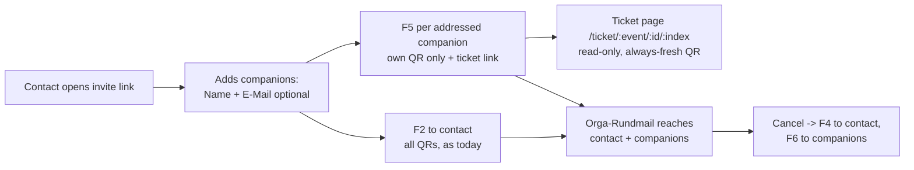

# 020 — Companion e-mail & personal ticket page (Festival)

**Status:** spec, pre-implementation
**Author:** Arne (discovery), Claude (write-up)
**Date:** 2026-07-30

> Builds on **019-festival-sidetrack** — that spec stays authoritative for everything not touched here. German terms kept on purpose: **Gästeliste** (an invite batch), **Begleitung** (companion), **Zeitfenster** (time slot), **Eintritts-Code** (the QR ticket). All guest-facing copy stays German. Decision markers **D1–D4** track the choices made with the organiser on 30.7.

## Context

A festival registration today (spec 019) collects the contact person's **name, e-mail and phone**, plus **bare names** for their companions: `group_members` is a `list[str | None]`, one validated full name per person, nothing else. Only the contact ever receives mail. F2 embeds a QR code for *every* person in the group (T312), and the contact then has to work out which code belongs to whom and forward it by hand — WhatsApp, screenshot, whatever works.

That costs us two things:

1. **The contact person is a courier.** Codes get mixed up or never arrive, and a companion without their code falls back to name-search at the gate — the slow lane, exactly at the Friday-evening peak.
2. **Companions are permanently unreachable.** We store no address for them, so no follow-up can ever reach them: not the Orga-Rundmail, not „die Anmeldung wurde storniert, dein Code ist tot". They exist only as a name on the printed gate list.

This spec makes the companion e-mail an **optional second field per companion row**. When it is given, that person becomes a first-class recipient: their own mail with **only their own** Eintritts-Code, their own read-only ticket page, and their address stored as their contact address for all later festival communication. When it is not given, **nothing changes** — the contact keeps forwarding QRs exactly as today.

Nothing about this spec is festival-capacity relevant: it changes who *receives* information, never who is counted. Headcount, Kontingente, slot caps and the gate all behave identically.

## How the flow works



### (a) Contact-person flow

1. Open the personal invite link as today. Under **„Wen bringst du mit?"** each companion row now has **two** fields: `Vor- und Nachname` (as before) and `E-Mail (optional)`.
2. Nudge copy under the fieldset: „E-Mail (optional) — dann schicken wir den Eintritts-Code direkt an die Person. Ohne E-Mail bekommst du alle Codes und leitest sie selbst weiter."
3. Submit → the contact receives **F2 unchanged**: the full group QR set, so they can always still forward. On the manage page each companion row shows either „Code an l…@… geschickt" or „Kein Code verschickt — leite ihren QR weiter", so the contact knows exactly whom they still have to chase.
4. Adding or correcting a companion's address later on the manage page sends that person their code. Changing only the Zeitfenster sends nothing.

### (b) Companion flow

1. Receive **F5** with their name, the chosen Zeitfenster, **one** embedded QR — theirs — and a link to their personal ticket page.
2. Open the ticket page any time: own name, festival dates, own days, own QR, Mitmach-Hinweis, contact address. **No edit, no cancel, no other person's data.**
3. Receive the Orga-Rundmail like everyone else, and a cancellation notice if the whole registration is cancelled.
4. Arrive → show the QR → wristband. Identical to any other person at the gate; `person_index` is untouched.

### Decisions (D1–D4, organiser 30.7.)

| # | Decision | Why |
|---|---|---|
| **D1** | Companions get a **read-only personal ticket page**, never the group manage link | The manage token can edit slots, rename people and **cancel the entire group**. Handing it to every companion is a footgun. A separate read-only capability costs one endpoint and one page. |
| **D2** | Follow-ups reaching companions: **Orga-Rundmail** + **cancellation of the whole registration**. Nothing else — in particular **no** automatic resend when the contact renames a companion | Mail on every slot edit is noise. Rename needs no resend because the ticket page always signs a **fresh** ticket, so the link in F5 self-heals; only the PNG baked into the original mail can go stale. |
| **D3** | Only the **guest paths** (public register, public self-edit) send companion mail. The admin patch path accepts the field but stays mail-silent | Mirrors the earlier phone-required change, which also deliberately left admin semantics alone. Organisers correcting a typo should not fire mail at guests. |
| **D4** | The companion e-mail is **optional** | Required would block people who genuinely don't know their +1's address, and would diverge from every row already in the table. |

### Deliberately unchanged

- **Headcount, Kontingente, `max_uses`/`max_group_size`, slot caps, the gate.** A companion address is contact data, not capacity data.
- **The duplicate-registration check.** `_check_duplicate_email` queries the `email-index` GSI, which indexes only `Registration.email`. Companion addresses are **not** in that index, so a companion can still redeem their own invite later — same behaviour as today, deliberately kept.
- **The gate CSV stays address-free.** `build_gate_rows` produces a paper list carried around a festival site; an e-mail column is pure leak surface with zero operational use.
- **The public Gästelisten page must not change.** `GuestlistRegistrationRow` is name-only by design and `GuestlistPage.vue` promises so in its own footer.

## Emails

New placeholders: `{Kontaktperson}` (the registration contact's name), `{TicketLink}` (the companion's personal ticket page). Both to be added to `infra/mail-vorlagen.md` alongside the new templates as **§18** and **§19**.

### F5 — Companion ticket

**When?** On registration, for every companion who has an address; and on a self-edit, for every companion whose address was newly added or corrected.

**Subject:** `Dein Eintritts-Code: {Veranstaltung}`

```
Moin {Name},

{Kontaktperson} hat dich für "{Veranstaltung}" angemeldet — schön, dass
du dabei bist!

Deine Anmeldung:
- Wann: {Zeitfenster}

Dein Eintritts-Code ist unten in dieser Mail eingebettet — am Einlass
zeigst du ihn einfach vor, ein Screenshot reicht.

Dein Code, immer aktuell:
{TicketLink}

{MitmachHinweis}

Wenn sich etwas ändert — andere Tage, oder du kannst doch nicht — melde
dich bei {Kontaktperson}: die Anmeldung für euch alle läuft dort zusammen.

Bei Fragen: {KontaktAdresse}

Bis bald,
Dein Orga-Team
```

*Contains exactly **one** QR (`cid:qr-{person_index}`). No manage URL, no other person's code, no Schlafplatz line — tent/camper is a group-level request the contact coordinates.*

### F6 — Companion cancellation

**When?** When the whole registration is cancelled — via the guest's own cancel or the admin cancel, i.e. wherever F4 already goes out.

**Subject:** `Abgesagt: {Veranstaltung}`

```
Moin {Name},

{Kontaktperson} hat die Anmeldung für "{Veranstaltung}" storniert — für
dich damit auch. Dein Eintritts-Code funktioniert nicht mehr.

Wenn das ein Versehen war, melde dich bei {Kontaktperson} — oder schreib
uns: {KontaktAdresse}

Bis zum nächsten Mal,
Dein Orga-Team
```

### Orga-Rundmail (existing template 12)

The admin bulk mail fans out to companion addresses too — this is the core of the request. Companion copies are **identical in subject and body**, but never carry the manage link: where the contact's copy appends `{Verwaltungslink}`, the companion's appends `{TicketLink}`.

## Technical implementation

### Architecture

Purely additive on top of 019. No new table, no new GSI, no migration, no new dependency (`qrcode[pil]` is already in). Deploy is API + worker + frontend.

**Critical structural constraint:** `person_index` position is load-bearing. `group_members` is append-only with `None` tombstones and is **never reindexed**, because HMAC ticket payloads carry `p = person_index` (spec 019 §Registration index stability). Everything below preserves that.

### Data model deltas

**Registration** (`backend/app/models/registration.py`) — one additive optional field:

- `group_member_emails: list[EmailStr | None] | None` — **index-aligned with `group_members`**. `None` at index *i* = „no address for `group_members[i]`". A tombstoned member must also have `None` here. Model validator: when both lists are present, equal length (pad short with `None`, reject longer). Normalised lowercase + stripped. Legacy rows read as `None`.

**Why a parallel array rather than `group_members: list[GroupMember{name,email}]`:** `group_members` is shared with the regular single-event flow — `api/admin/events.py`, `public/registrations.py`, the spec-018 registration detail page, `build_gate_rows`, `checkin_service.search_names` — and its list *position* is the ticket `person_index`. A parallel array is additive and cannot disturb any of that; a restructure would touch every one of those call sites plus the whole test suite for no functional gain.

Same field added to: `FestivalRegistrationCreate` (checked against the existing `len(group_members) == group_size - 1` rule in the service), `FestivalAttendancePatch` and `RegistrationAdminPatch` (**both `extra="forbid"` — they 422 without it**), and `RegistrationResponse`.

**Message** (`backend/app/models/message.py`) — two new `MessageType` values: `FESTIVAL_COMPANION_TICKET`, `FESTIVAL_COMPANION_CANCELLATION`.

### Recipient resolution — one helper, used everywhere

New pure, HTTP-free helper in `registration_service.py` next to `build_gate_rows`, so all three send sites and the Rundmail fan-out share one rule set:

```python
def companion_recipients(registration) -> list[CompanionRecipient]:
    """(person_index, name, email) for every companion with a usable address."""
```

Skips: tombstoned members; members without an address; addresses equal to `registration.email` (the contact already gets F2 with every QR); within-group duplicates, first index wins; every CANCELLED registration. `person_index = i + 1` — the same offset `build_person_tickets` uses.

### Per-person capability token

`backend/app/services/ticket_signing.py`, alongside `sign_ticket`:

```python
def person_page_token(registration_token: str, person_index: int) -> str
def verify_person_page_token(registration_token: str, person_index: int, token: str) -> bool
```

`b64url(HMAC-SHA256(registration_token, f"P{person_index}").digest()[:16])`.

Derived from the **registration token, deliberately not from `event.ticket_secret`**: the ticket secret is handed to every gate client via the scanner boot call (019 Risk #6), so a person token derived from it would be forgeable by anyone holding a gate link. HMAC is one-way, so a leaked person token reveals nothing about the group token and grants no write capability. Stateless — nothing stored, valid for every existing registration, stable across slot and name edits.

### API endpoints

**Public** — `backend/app/api/public/registrations.py`, next to `get_registration_manage`:

- `GET /api/public/tickets/{event_id}/{registration_id}/{person_index}?token=` → `PersonTicketResponse`: person name, event name + period, chosen slot **labels**, `participation_hint`, `contact_hint`, the contact person's **name**, `group_size`, and a **freshly signed** ticket code (reuse `build_person_tickets`, pick the matching index).
  Deliberately absent: the registration token, any other person's name, phone numbers, e-mail addresses, tent/camper data, and every write verb. 404 on unknown registration, mismatched token or tombstoned index. A CANCELLED registration returns a readable „diese Anmeldung ist storniert" state rather than a 410 — mirrors the `can_register=false` treatment on the Gästelisten page.

**Admin** — `backend/app/api/admin/events.py`:

- `CustomMessageRequest` gains `include_companions: bool = True`; `send_custom_message` loops `companion_recipients` after the contact's mail. **One `Message` row per recipient**, so the message log and the `sent`/`failed` counters stay honest.

### Services & guards

- `email_service.py`: `EmailContext` gains `contact_name` and `person_ticket_url`; new `_build_person_ticket_url(...)` next to `_build_management_url`; templates `festival_companion_ticket` (F5) and `festival_companion_cancelled` (F6); send methods `send_festival_companion_ticket(event, registration, recipient)` — mirroring the existing `ensure_gate_credentials` → `build_person_tickets` → `generate_qr_png` sequence in `send_festival_confirmation`, filtered to one index — and `send_festival_companion_cancellations(event, registration)`. Both go through the existing `_send_email` queue writer, so the worker path, `inline_images`, Date/Message-ID and `List-Unsubscribe` handling all come for free.
- `registration_service.py` send sites:
  - **create** — `create_festival_registration`, immediately after the never-fail F2 block: loop recipients with a `try/except` **per recipient**, so one bad address can neither cost the others their code nor fail the registration. Structured log per send: `flow="festival", step="companion_ticket_email", outcome=ok|error, person_index=…`; addresses never logged in full.
  - **self-edit** — `update_festival_attendance`: diff old vs. new `group_member_emails` **by index**; send only where the new value is non-null **and differs**. Address added later → one mail; typo corrected → one mail; slot-only edit → nothing; rename → nothing (D2).
  - **cancel** — the festival branch of `cancel_registration`, wherever F4 already goes out. Covers self-cancel and admin cancel: a companion who isn't told turns up at the gate with a dead QR.
  - **admin patch** — `admin_update_registration` diffs the field into its `set_parts`/`remove_parts` and sends **nothing** (D3).

### Frontend

New route `/ticket/:eventId/:registrationId/:personIndex` — no auth guard, the token is the auth (same as `/invite/:inviteToken`).

`event_id` sits in the path because registrations are keyed `pk=EVENT#{event_id}` / `sk=REG#{id}`: without it every view of this public, unauthenticated page would cost a DynamoDB table scan. The URL is only ever clicked from a mail, so the extra segment is free.

- `pages/registration/PersonTicketPage.vue` (new) — own name, festival period, own days, own QR (client-side `qrcode`, reusing the canvas-ref pattern from `RegistrationManagePage.vue`), Mitmach-Hinweis, contact address. Copy states the boundary explicitly: „Änderungen (Tage, Absage) laufen über {Kontaktperson}." No edit or cancel affordance anywhere on the page.
- `pages/registration/FestivalRegistrationPage.vue` — companion rows become `{name, email}`; optional `type="email"` input per row with the nudge copy; in `handleSubmit` filter names and addresses **jointly** so both arrays stay index-aligned once empty rows drop out. Client-side format check only; never required.
- `pages/registration/RegistrationManagePage.vue` — e-mail input per companion row; `handleSaveFestival` sends both arrays. Per-companion status line („Code an l…@… geschickt" / „Kein Code verschickt — leite ihren QR weiter"). The QR grid stays complete so the contact can always forward, with a muted badge on companions who have their own address.
- `pages/admin/festival/FestivalRegistrationsPage.vue` — companion addresses in the row detail, so organisers can see who is actually reachable.
- `components/MessageComposer.vue` — `+N Begleitungen mit E-Mail` per row and an `include_companions` checkbox, default on.
- `services/api.js` — `publicApi.getPersonTicket`; help copy in `components/help/FestivalHelp.vue` / `helpContent.js` and `docs/anleitung.md`.

### Risks

1. **Two lists that must stay aligned.** The parallel-array choice trades a restructure for an invariant. Mitigated by: a model validator on every write path, joint filtering in the frontend, and an explicit test for a length mismatch (422) and for an address on a tombstoned index (rejected).
2. **A stale QR in an old F5.** After a rename the PNG in the already-sent mail no longer verifies (the gate shows „Ticket veraltet — bitte Namenssuche"). Accepted per D2, because the `{TicketLink}` in the same mail always renders a fresh code. The gate's name-search fallback covers the guest who only kept the screenshot.
3. **More mail volume per registration.** A group of 5 fully addressed now sends 5 mails instead of 1, and the Rundmail multiplies the same way. Same SMTP path and queue as today, and the per-recipient `try/except` keeps one bad address from taking down a batch — but worth watching in the send log during the first wave.
4. **Companion addresses are contact data in a new place.** They are excluded from the Gästelisten page, the gate CSV and the `email-index` GSI by explicit test. The person token grants read access to one person's own row only.

### Verification

- **Backend** (`cd backend && uv run pytest`, `moto` + `FestivalTestBase`, services patched at source module): create with two companions of which one is addressed → exactly one F5 queued, `content_id == "qr-2"` only, no manage URL in either body; companion address == contact address → no F5; duplicate addresses in one group → one F5; length mismatch → 422; address on a tombstoned index → rejected; legacy item without the attribute → reads `None` and F2 unchanged; self-edit matrix (address added → 1, slot-only → 0, rename → 0); cancel → one F6 per addressed companion; `person_page_token` with wrong index / wrong registration token / tampered token → 404, valid → a ticket `verify_ticket` accepts; ticket page after a rename → new name and a verifying ticket (the self-healing claim); `include_companions` off → contact only, on → one `Message` row per recipient with the ticket URL and not the manage URL; **regression: the Gästelisten response contains no `@` in any field.**
- **Frontend** (`npm run build`; no test runner in this repo): register with one addressed and one unaddressed companion and check both arrays in the payload; open the ticket URL and confirm one QR and no edit/cancel affordance.
- **E2E on the deployed stack** — register a group of 3 with one companion address → two mails arrive, the companion's carries exactly one QR → **scan that companion's QR on `ScannerPage`** via the gate link: the real proof that their code alone checks *them* in with `person_index` intact → send an Orga-Rundmail with `include_companions` on → cancel and confirm F6.

## Anhang B — latent `utcnow()`-sed bugfixes (separate commit, landed first)

Not part of the feature; bundled into this work package because they were found while reading the model layer. A past `utcnow()` → `datetime.now(...)` sed left **five** mangled expressions, each with a stray `lambda: ` prefix and a stray trailing `()`:

```python
if lambda: datetime.now(timezone.utc)() >= self.registration_deadline:   # a lambda object is ALWAYS truthy
"sent_at": lambda: datetime.now(timezone.utc)(),                          # stores a lambda, not a timestamp
```

`grep -rn ")()" app/` plus `grep -rn "lambda:" app/ | grep -v default_factory` are together exhaustive for the pattern; `utcnow` itself is already gone from the tree.

| # | Site | Broken method | Callers | Effect today |
|---|---|---|---|---|
| B1 | `models/event.py:252` | `Event.is_registration_open()` | **none** — the only match in the repo is its own `def` | Would always return `False` for an OPEN event |
| B2 | `models/registration.py:479` | `Registration.set_attendance_response()` | **none** — the same-named *service* method never calls the model helper; it writes `responded_at` itself in an `UpdateExpression` (`registration_service.py:1524`) | Would store a lambda in `responded_at` |
| B3 | `models/message.py:102` | `Message.mark_sent()` | **none** — the worker marks messages with direct `UpdateExpression`s (`workers/handler.py:264, 309, 320, 547, 558`); `mark_failed`/`can_retry`/`reset_for_retry` are unused too | Would store a lambda in `sent_at` |
| B4 | `models/admin.py:103` | `Invitation.is_expired` | only B5 | Always truthy → any accept raises „Invitation has expired" |
| B5 | `models/admin.py:116` | `Invitation.accept()` | **none** — `Invitation`/`InvitationCreate` are only re-exported in `models/__init__.py`; no route, no service, no test | Unreachable, and blocked by B4 anyway |

B4/B5 are the **admin org-invitation** model, not the festival `Invite` — that one's `is_expired(registration_deadline)` is correct, live and covered by `test_invite_service.py`. Easy to conflate; do not touch it.

**The fix is behaviour-preserving by construction:** every one of the five sits in unreachable code, which is precisely why the damage went unnoticed. Strip `lambda: ` and the trailing `()`, keeping each file's existing idiom (`registration.py` imports `UTC`, the other three use `timezone.utc`; every name is already imported). Five one-line diffs, no import changes. Nothing gets wired up: `is_registration_open()` stays uncalled, the festival flow keeps its inline deadline check, the single-event flow keeps writing `responded_at` in its `UpdateExpression`.

**Pinned by** new `backend/tests/unit/test_model_datetime_helpers.py` (pure model tests, no `moto`) — the guard rails that make the fix meaningful, since no production caller exercises them: `is_registration_open` across statuses and both deadline sides; `set_attendance_response` asserting `responded_at` is a **tz-aware `datetime`** (the assertion that would have caught the lambda) plus its `ValueError`; `Message.mark_sent` round-tripped through `_message_to_item` to prove it now serialises; `Invitation.is_expired` both ways and all three `accept()` outcomes.

**Empirical check on top of the caller analysis:** run the full suite before and after and confirm the result is identical apart from the new file's passes. Then re-run both greps and confirm the only surviving `lambda:` hits are legitimate `default_factory` ones.

## Open points / deliberately left out

- **Per-companion phone numbers** — the phone is for Stellplatz coordination, which the contact person handles for the whole group (019 Ä15/Ä17). No reason to collect more.
- **Letting companions edit anything** — explicitly rejected (D1). If self-editing per person is ever wanted, it needs its own capacity and grandfathering story, not a widened token.
- **Deleting the dead model helpers in Anhang B** — removing public model surface is a separate judgement call from fixing it.
- **Overnight approval mail** — unchanged from 019: approval is coordinated by phone, no automatic mail.
- **Wallet passes** — declined on cost grounds (Apple Developer Program $99/yr, Google Wallet needs Issuer registration). Do not re-propose without a change in that constraint.
