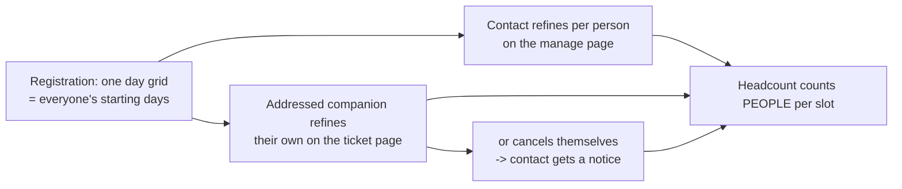

# 021 — Per-person attendance days (Festival)

**Status:** spec, pre-implementation
**Author:** Arne (requirement), Claude (write-up)
**Date:** 2026-08-05

> Builds on **019-festival-sidetrack** and **020-festival-companion-tickets**. Amends 019 **Ä12** (slots were per-registration, shared) and 020 **D1** (the companion page was read-only). Decision markers **E1–E4**.

## Context

Spec 019 Ä12 made the time-slot grid a property of the **registration**: one set of `attendance_slots` shared by the whole group, with the headcount board adding `group_size` to every slot the group ticked. That was a deliberate simplification, and 019 even argued the case against per-person data — the contact person "practically never" knows when each companion is coming, which is why it recommended raising `max_uses` over `max_group_size`.

Spec 020 then gave companions their own address, their own QR, and their own page. That changes the calculus: an addressed companion can now be asked directly. The organiser requirement is exactly that — *"they also must be able to manage their participation … so that we know when people are individually planning to come."*

Today a group of four that ticked „Freitag, Samstag" counts as four people on both days, even if two of them only come on Friday. The board overstates Saturday and understates nothing, so catering and Stellplatz planning work from numbers nobody can correct.

## Decisions (organiser, 5.8.)

| # | Decision | Why |
|---|---|---|
| **E1** | **Days stay one grid at registration.** The group's `attendance_slots` remain the declared days and become every person's *starting* days. Individual days are a later **refinement**, not a new question on the form. | 019's argument still holds at registration time: the contact usually doesn't know. Asking four grids up front adds friction for every group, including the many with no addresses at all, to collect data that would mostly be guesses. |
| **E2** | Refinement happens in two places: the **contact** can adjust any companion's days on the manage page, and an **addressed companion** can adjust their own on their ticket page. | Unaddressed companions have no page, so without the contact's path they could never have individual days at all. |
| **E3** | A companion may also **cancel themselves** — own days plus own removal, nothing more. Not their name, not anyone else's days, not the group, not the overnight request. | Organiser choice. Self-removal is the single most valuable correction for headcount accuracy, and it is safely scoped: the token already addresses exactly one person. |
| **E4** | **Overrides only.** `member_slots` stores a person's days *only when they differ* from the group's. Absent override = the group's days. | Makes the change invisible until used: with no overrides every derived number — headcount, gate CSV, QR payload, F5 — is byte-identical to today. No migration, no backfill, no reinterpretation of existing rows. |

### The property that makes E4 worth it

Headcount changes from "add `group_size` per group-slot" to "add 1 per person per that person's effective slots". With zero overrides these are **arithmetically identical** (every person has the group's slots, so each slot gets `group_size` again). So the new counting can ship without organisers seeing a single number move, and every number that *does* move afterwards moves because a human corrected it.

## How it works



**Effective days of person *i*** = `member_slots[str(i)]` if present, else the registration's `attendance_slots`. Person 0 is the contact; `i ≥ 1` is `group_members[i-1]`, the same indexing as the QR `person_index`.

## Data model

**Registration** (`backend/app/models/registration.py`) — one additive field:

- `member_slots: dict[str, list[str]] | None` — **overrides only**, keyed by the person index as a string (`{"0": ["fr"], "2": ["fr", "sa"]}`).

A sparse **map**, deliberately not a third parallel array: it carries no alignment burden (nothing to pad, nothing to keep in lockstep), a missing key is meaningfully "no override", and it survives the append-only/tombstone rules without needing to track length. The two arrays of spec 020 already cost enough vigilance.

Validation, mirroring the discipline already applied to `group_member_emails`:
- every key must be a non-negative integer within the group (`0` .. `len(group_members)`);
- an override on a **tombstoned** member is dropped;
- each override is non-empty and, at service level, a subset of `event.slot_keys()`;
- an override equal to the group's `attendance_slots` is dropped (keeps the map to genuine differences, so "has this person been asked?" stays answerable).

Helper: `effective_member_slots(registration, person_index) -> list[str]`, the single reader used by headcount, gate CSV, ticket signing and F5. One reader means those four can never disagree.

## API

**Public, companion-facing** — extends the ticket surface from 020 (`backend/app/api/public/registrations.py`), all authenticated by the same per-person token:

- `GET  /api/public/tickets/{event_id}/{registration_id}/{person_index}` — additionally returns `all_slots` (the event's full slot list, so the page can render unticked options) and `own_slots` (this person's effective days). **Was read-only, now the boot call for an editable page.**
- `PATCH …/{person_index}?token=` — `{attendance_slots: [...]}` → sets this person's override. Rejects an empty list, unknown keys, a tombstoned index, and anything past the edit deadline. Sends **no mail** (a day change is low signal and would spam the contact).
- `POST  …/{person_index}/cancel?token=` — self-removal (E3): tombstones `group_members[i]`, clears `group_member_emails[i]` (so the page dies with them, and the arrays stay aligned), drops their override, and decrements `group_size`. Does **not** release an invite use — a use is one *registration*, not one seat (019 §Invite). Sends **F7** to the contact, whose planning numbers just changed.

**Public, contact-facing** — `FestivalAttendancePatch` gains `member_slots`, so the manage page can set any companion's days in the same save it already uses.

**Admin** — `RegistrationAdminPatch` gains `member_slots` (organisers fix data after a phone call). Mail-silent, consistent with 020 D3.

## Consumers of the new reader

| Surface | Change |
|---|---|
| `get_headcount` | Counts **people** per slot via `effective_member_slots`, not `group_size` per group-slot. Identical output when no overrides exist. |
| `build_gate_rows` | Already one row per person; its slot columns become that person's days instead of the group's. |
| `ticket_signing.build_person_tickets` | The `s` payload becomes the person's own days. Informational only at the gate (Ä13), so nothing about check-in changes. |
| F5 companion ticket mail | „Wann" shows the recipient's days. |
| Manage page / ticket page | Per-person day display and editing. |

## Emails

### F7 — Begleitung hat abgesagt (to the contact)

**When?** A companion removes themselves via their own ticket page. The contact's headcount just changed without their involvement, so they must hear about it.

**Subject:** `Änderung bei deiner Anmeldung: {Veranstaltung}`

```
Moin {Name},

{Begleitung} hat sich von deiner Anmeldung für "{Veranstaltung}"
abgemeldet — der Eintritts-Code dieser Person gilt nicht mehr.

Ihr seid jetzt {Personen} {Personenwort}.

Deine Anmeldung verwalten:
{Verwaltungslink}

Bei Fragen: {KontaktAdresse}

Bis bald,
Dein Orga-Team
```

New placeholder: `{Begleitung}` — the name of the companion who left.

## Security note — the person token becomes a write capability

In 020 the token was read-only, which was most of its safety argument. It now permits two writes, and that is a deliberate widening. What it still cannot do, and this is the boundary worth stating precisely: it cannot read or write **any other person's** data, cannot cancel the **group**, cannot rename anyone, cannot touch the overnight request, and cannot be reversed into the group's `registration_token`. The blast radius of a forwarded companion link is exactly that one companion's days and their own attendance — the same authority the person would have by asking the contact.

The 020 binding (token = HMAC over `registration_token` + index + address) keeps doing its job: replacing the occupant of an index invalidates the previous holder's link, so a departed companion cannot edit their replacement's days.

## Verification

- **Backwards compatibility is the headline test**: with no overrides, `get_headcount`, `build_gate_rows` and the signed QR payloads must be **identical** to the pre-021 output for the same data. Assert equality against explicitly constructed expected values, not against a snapshot of the new code.
- Override semantics: set / change / clear; an override equal to the group's days is dropped; an override on a tombstone is dropped; unknown slot key rejected; empty list rejected.
- Headcount with mixed overrides: a group of 4 where 2 people dropped Saturday counts 4 on Friday and 2 on Saturday.
- Companion PATCH: valid token changes only that person; another person's token cannot; past the deadline is refused; no mail is sent.
- Companion self-cancel: tombstones only that index, `group_size` drops by exactly 1, their address is cleared, their page then 404s, their QR is no longer issued, the contact receives F7, and the invite `use_count` is **unchanged**.
- Index stability under self-cancel: a later companion keeps their original `person_index` and their still-valid QR.
- The privacy boundaries of 019/020 hold: Gästelisten page still name-only, gate CSV still address-free.

## Deliberately out of scope

- **Per-person overnight, phone, or name.** Overnight is a group-level Stellplatz request the contact coordinates (019 Ä15/Ä21); names stay with the contact so the gate's stale-ticket check keeps working.
- **Per-person days at registration time** (E1) — revisit only if organisers find the refinement path is not being used.
- **Letting a companion add someone.** Group size is the contact's business; the invite allowance is enforced on their path.
